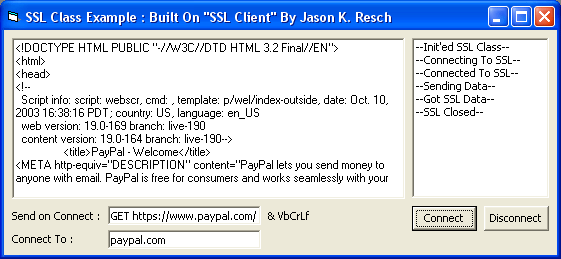

## SSL Class With Events

### Description

Here is My SSL Class, it is Built On "SSL Client" By Jason K. Resch. You can use it just like as if it was a normal winsock socket. It has events for close, connect, datasending, dataarrival. I find its much easier to use than anything here on pscode. Enjoy! Please Vote! :D
 
### More Info
 

             |
---                |---
**Submitted On**   |2003-10-11 06:53:02
**By**             |[Christopher Hemple](https://github.com/Planet-Source-Code/PSCIndex/blob/master/ByAuthor/christopher-hemple.md)
**Level**          |Advanced
**User Rating**    |4.2 (25 globes from 6 users)
**Compatibility**  |VB 6\.0
**Category**       |[Internet/ HTML](https://github.com/Planet-Source-Code/PSCIndex/blob/master/ByCategory/internet-html__1-34.md)
**World**          |[Visual Basic](https://github.com/Planet-Source-Code/PSCIndex/blob/master/ByWorld/visual-basic.md)
**Archive File**   |[SSL\_Class\_16569710112003\.zip](https://github.com/Planet-Source-Code/christopher-hemple-ssl-class-with-events__1-49170/archive/master.zip)

